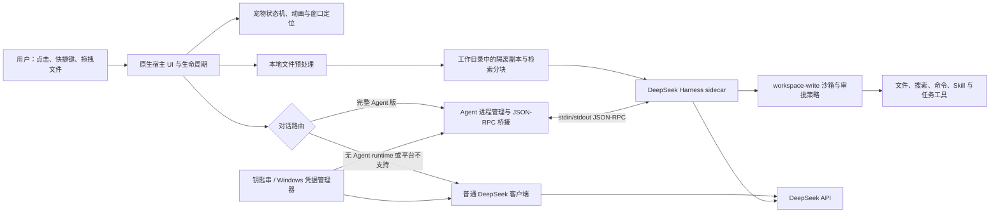

# 哈妮丝（DesktopPet / PetHarness）

哈妮丝是一只运行在 macOS 和 Windows 桌面上的原生小柴犬，也是一套带安全审批能力的本地 DeepSeek Agent 宿主。它可以随机散步、待机、被拖动和点击互动；配置自己的 DeepSeek API Key 后，还可以进行连续对话、分析拖入的文件，并在用户选定的工作目录内读取文件、修改项目和运行命令。

项目不依赖 Electron：macOS 宿主使用 Swift + AppKit，Windows 宿主使用 C++20 + Win32。完整 Agent 以独立 sidecar 进程运行，通过换行分隔的 JSON-RPC 与原生界面通信。

## 主要能力

- 透明、无边框、置顶的桌面宠物窗口，支持随机散步、呼吸、眨眼、睡觉、四帧步态和等待召唤动画
- 鼠标拖拽、单击互动、尺寸记忆、暂停、隐藏、复位和等待时间设置
- 三连击唤醒对话；macOS 支持全局快捷键 `⌥⌘0`，Windows 支持 `Ctrl+Alt+0`
- 使用用户自己的 DeepSeek API Key，支持 `deepseek-v4-flash` 与 `deepseek-v4-pro`
- 完整 Agent 版支持工作目录、会话持久化、本地 Skill、任务清单、长期目标和 DeepSeek 网页搜索
- 支持拖入 1–5 个 PDF、DOCX、XLSX、XLSM、TXT、Markdown、CSV、JSON 或常见代码文件进行分析
- Agent 对写入和命令请求展示审批；删除、提权、凭据访问、越界路径等高风险操作直接拒绝

普通宠物功能不需要网络；DeepSeek 对话和网页搜索需要网络及用户自己的 API Key。

## 平台与能力矩阵

| 运行形态 | 基础桌宠 | 普通 DeepSeek 对话 | 本地 Harness Agent | 拖拽文件分析 |
| --- | --- | --- | --- | --- |
| macOS 13+，Intel 或 Apple Silicon | 支持 | 支持 | 不支持 | 不支持 |
| Apple Silicon + macOS 14+，内含 Agent runtime | 支持 | 支持 | 支持 | 支持 |
| Windows 10/11 x64，单 EXE | 支持 | 支持 | 不支持 | 不支持 |
| Windows 10/11 x64，完整 Agent 安装包或便携包 | 支持 | 支持 | 支持 | 支持 |

macOS 与 Windows 是两个独立的原生宿主实现，功能方向一致，但个别设置仍有差异：

- macOS 普通对话最大输出默认 `8192` Token，Agent 默认 `256000`，均可设置为 `1–384000`。
- Windows 普通对话当前固定为 `500` Token，Agent 固定为 `8192`；Windows 设置页暂不提供 Token 上限配置。
- macOS 对话气泡支持 Markdown 与原生表格渲染；Windows RichEdit 气泡支持标题、列表、引用、粗体、斜体、删除线、行内代码和链接样式，但暂不提供原生表格布局。

## 普通用户安装

### macOS

当前 macOS 构建产物是 `DesktopPet.app`。如果从发布包获取：

1. 解压 macOS ZIP。
2. 将 `DesktopPet.app` 拖入“应用程序”。
3. 第一次启动时从 Finder 右键应用并选择“打开”。
4. 菜单栏出现爪印图标后，即可控制显示、暂停、尺寸、Agent 和退出。

如果发布页没有对应的 macOS 包，请按下文“macOS 开发与构建”从源码构建。完整本地 Agent 版必须是 Apple Silicon、macOS 14 或更新版本，并且应用包内含 `Contents/Helpers/DesktopPetAgent`；运行已打包的 App 不需要另装 Node、pnpm 或 Python。

### Windows

Windows 正式发布提供两种完整 Agent 产物：

- `DesktopPet-Windows-v<版本>-Agent-x64-Setup.exe`：推荐普通用户使用的安装包。
- `DesktopPet-Windows-v<版本>-Agent-x64-Portable.zip`：解压后直接运行 `DesktopPet-Windows-x64.exe`。

安装包和便携包都包含 `DesktopPetAgent/`、固定 Node 运行时和文件解析依赖，目标电脑不需要安装 Node、pnpm、Python、Swift 或 .NET。不要只从完整包中单独复制 EXE，否则本地 Agent 和文件分析不可用。

如果只需要桌宠和普通 DeepSeek 对话，也可以使用交叉编译生成的单文件 `DesktopPet-Windows-x64.exe`。

如果发布产物未使用 Authenticode 证书签名，Windows 可能显示“未知发布者”。请从项目 [GitHub Releases](https://github.com/Pickbert/PetHarness/releases) 下载，并使用同一发布中的 `SHA256SUMS.txt` 校验文件：

```powershell
Get-FileHash .\DesktopPet-Windows-v0.7.1-Agent-x64-Setup.exe -Algorithm SHA256
```

## 首次使用

1. 启动后，右键小狗或菜单栏/托盘图标，选择“设置 DeepSeek…”。
2. 填写自己的 API Key，并选择 `DeepSeek V4 Flash` 或 `DeepSeek V4 Pro`。
3. 连续快速点击小狗 3 次，或使用全局快捷键打开输入框。
4. 完整 Agent 版第一次对话会要求选择一个长期工作目录。
5. 输入问题并按回车；后续再次唤醒输入框可继续当前上下文。

API Key 不会写入项目文件：macOS 使用系统钥匙串，Windows 使用 Windows 凭据管理器。普通对话和 Agent 都直接连接 DeepSeek 官方接口。

### 拖拽文件分析

将文件拖到完整 Agent 版的小狗身上，本地预处理完成后再输入总结、对比、提取数据等要求。文件会复制到所选工作目录下：

```text
DesktopPet-FileAnalysis/<会话 ID>/
├── manifest.md
├── sources/       # 用户原文件的隔离副本
├── normalized/    # 标准化文本
└── chunks/        # 供 Agent 按需检索的分块
```

限制如下：

- 每批最多 5 个文件，原文件总量和解析后文本总量分别最多 100 MiB。
- 单文件默认上限 10 MiB，可设置为 1–100 MiB。
- PDF 保留页码，但扫描版 PDF 暂不支持 OCR。
- DOCX 暂不分析嵌入图片。
- XLSX/XLSM 会提取工作表、单元格、公式文本和缓存值，但不会执行宏、重算公式或还原图表和视觉样式。
- 不支持旧版二进制 `.xls`。
- 文件会话默认保留 7 天；可从“本地 Agent”菜单结束会话或清除当前工作目录的缓存。

### 等待召唤

默认连续 3 分钟没有点击、拖动、菜单操作或聊天后，哈妮丝会蹲坐等待。可在“设置等待时间…”中填写 `0–1440` 分钟；`0` 表示关闭自动等待。设置在重启后保留。

## 开发环境

### 基础 macOS 宿主

| 项目 | 要求 |
| --- | --- |
| 操作系统 | macOS 13 或更新版本 |
| 工具链 | Xcode 15 或兼容的 Swift 5.9 工具链 |
| Swift 依赖 | SwiftPM 自动获取 CoreXLSX `0.14.2` 及其锁定依赖 |
| 网络 | 第一次解析 SwiftPM 依赖时需要 |

### 完整 macOS Agent

除基础环境外，还需要：

- Apple Silicon（arm64）与 macOS 14 或更新版本
- Node.js `22.19+` 或 `24+`
- Node 自带或单独可用的 Corepack；构建脚本通过 Corepack 使用锁定的 pnpm
- 构建 Harness 依赖时可访问 npm registry

Node 18、Node 20 和 Node 22.0–22.18 不满足当前 Harness 与 PDF.js 构建/测试要求。

### 完整 Windows Agent 发布构建

完整包必须在 Windows 10/11 x64 上构建，要求：

- Visual Studio 2022 C++ Build Tools，包含 MSVC x64 工具链
- Windows 10/11 SDK（需要 `cl.exe`、`rc.exe`；签名时还需要 `signtool.exe`）
- PowerShell 5.1 或更新版本
- Node.js `22.19+` 或 `24+`、npm、Corepack
- Inno Setup 6（仅在生成安装包时需要；CI 固定使用 6.7.3）
- 可访问 npm registry；首次生成中文安装包时还需取得经哈希校验的简体中文语言文件

### macOS 交叉编译 Windows 基础版

只生成不带 Agent runtime 的单 EXE，需要 MinGW-w64：

```bash
brew install mingw-w64
```

## macOS 开发与构建

### 1. 获取源码

```bash
git clone https://github.com/Pickbert/PetHarness.git
cd PetHarness
```

Harness 源码已经固定并保存在 `ThirdParty/deepseek-harness`，不是 Git submodule，不需要额外执行 `git submodule update`。

### 2. 构建并运行基础版

```bash
./scripts/run.sh
```

脚本会以 release 配置构建并打开：

```text
build/DesktopPet.app
```

也可以只构建 App：

```bash
./scripts/build-app.sh release
```

未找到 Agent runtime 时，构建脚本会给出警告，但基础桌宠和普通 DeepSeek 对话仍可使用。

直接通过 SwiftPM 调试可执行目标：

```bash
swift run DesktopPet
```

`swift run` 适合代码调试；需要完整 `.app` 目录结构、Helper、Info.plist 和签名时应使用 `build-app.sh`。

### 3. 构建完整 macOS Agent 版

先确认 Node 版本：

```bash
node --version
corepack --version
```

再构建固定版本的 Harness 单文件 runtime，并要求 App 打包时必须找到它：

```bash
./scripts/build-agent-runtime.sh
DESKTOPPET_REQUIRE_AGENT_RUNTIME=1 ./scripts/build-app.sh release
```

生成的 runtime 位于 `.build/agent-runtime/`，并会被复制到：

```text
build/DesktopPet.app/Contents/Helpers/DesktopPetAgent
```

正式分发应使用稳定的 Developer ID 身份签名；默认构建使用 ad-hoc 签名：

```bash
DESKTOPPET_CODESIGN_IDENTITY="Developer ID Application: Your Name (TEAMID)" \
  DESKTOPPET_REQUIRE_AGENT_RUNTIME=1 ./scripts/build-app.sh release
```

## Windows 开发与构建

### 基础单 EXE（在 macOS 交叉编译）

```bash
./scripts/build-windows.sh
```

输出：

```text
build/windows/DesktopPet-Windows-x64.exe
```

该文件包含基础桌宠和普通 DeepSeek 对话，不包含本地 Agent 和拖拽文件解析 runtime。

### 完整 Agent 包（在 Windows x64 原生构建）

请从 Visual Studio 的 x64 Developer PowerShell 运行：

```powershell
corepack enable
powershell -ExecutionPolicy Bypass -File .\scripts\build-windows-package.ps1 `
  -CreateInstaller -CreatePortableZip
```

脚本会：

1. 使用 MSVC C++20 编译 Win32 宿主和资源。
2. 构建并部署固定版本的 DeepSeek Harness。
3. 安装 Windows 文件解析器的生产依赖。
4. 打包 `node.exe`、Agent 配置、许可证和完整运行依赖。
5. 使用本机回环模拟服务完成 Agent 初始化与对话 smoke test，不需要真实 API Key。
6. 可选生成安装包、便携 ZIP 和 SHA-256 清单。

默认输出目录为 `build/windows-agent-package-v<版本>`。为防止旧依赖混入新包，如果目录已经存在，脚本会直接失败；请使用一个新的明确目录：

```powershell
powershell -ExecutionPolicy Bypass -File .\scripts\build-windows-package.ps1 `
  -OutputDirectory .\build\windows-agent-package-local-001 `
  -CreatePortableZip
```

Windows 版本号以 `windows/VERSION` 为唯一发布输入，并由脚本校验资源文件和安装器版本。推送同版本的 `v<版本>` 标签会触发 `.github/workflows/windows-release.yml` 创建 GitHub Release；未配置签名 Secrets 时产物保持未签名。

## 整体架构

下面是两个原生宿主共享的概念架构。macOS 与 Windows 没有共享 UI 源码，但遵循相同的数据流和安全边界。



### 分层职责

| 层 | macOS 实现 | Windows 实现 | 主要职责 |
| --- | --- | --- | --- |
| 应用入口与系统集成 | `DesktopPetApp.swift`、`AppDelegate.swift` | `windows/DesktopPet.cpp` | 生命周期、菜单栏/托盘、全局快捷键、设置 |
| 宠物交互与渲染 | `PetController.swift`、`PetView.swift`、`PetMotion.swift` | `windows/DesktopPet.cpp` | 行为状态、动画、拖拽、点击、屏幕边界与窗口移动 |
| 对话 UI | `ChatInputController.swift`、`SpeechBubbleController.swift` | `windows/DesktopPet.cpp` | 输入浮层、结果气泡、工具状态与审批交互 |
| 普通对话 | `DeepSeek.swift` | `CallDeepSeek` / WinHTTP | 凭据读取、模型设置、上下文与 DeepSeek HTTP 请求 |
| Agent 桥接 | `AgentProcessManager.swift` 等 | `AgentRuntime.cpp/.h` | sidecar 生命周期、JSON-RPC、会话、通知、审批和插件状态 |
| 文件预处理 | `FileAnalysis.swift` | `FileAnalysisRuntime.cpp/.h` + `Agent/windows-file-analysis` | 类型校验、复制、文本标准化、分块、清理和超时 |
| Agent 组合 | `Agent/cordis.yml` | `Agent/cordis-windows.yml` | 模型适配器、沙箱、审批、工具、持久化和可选插件 |
| 上游 runtime | `ThirdParty/deepseek-harness` | 同左 | 固定提交的 DeepSeek Harness 源码与运行时依赖 |

### 对话路由

1. 原生宿主收集问题、当前模型、API Key 和最近对话上下文。
2. 如果平台支持且应用包中存在完整 runtime，宿主启动或复用 Agent sidecar。
3. 宿主发送 prompt 后，按 Harness 返回的 `messageId` 等待对应的持久化入队回执，再收集这一轮通知，避免把历史恢复事件误当成新回答。
4. 如果 runtime 不存在或平台不支持，则使用原生 HTTP 客户端进入普通对话，不提供文件和命令工具。
5. 工具运行状态会显示在气泡或任务面板中；需要用户决定的写入和命令进入审批流程。

### Agent 与安全边界

- Agent 的工作目录由用户首次使用时明确选择，文件工具和命令工具限制在该目录内。
- 默认策略是 `workspace-write + ask`：读取可以自动进行，写入和命令需要确认。
- “允许所有”只对当前 sidecar 运行期间的后续安全操作有效；更换目录、重启 Agent 或退出应用后失效。
- 删除、提权、访问凭据、明显破坏性命令和结构化越界路径始终拒绝。
- macOS sidecar 是 App 监管的独立进程；Windows 使用匿名管道和 Job Object，确保主程序退出时回收 sidecar 及其子进程。
- 本地 Skill 只从所选工作目录的 `.desktop-pet/skills` 加载，不扫描用户级的 `~/.agents`、`~/.dsh` 等目录。
- 外部 npm/GitHub 插件不会在运行时下载执行；新增插件必须固定版本、审核后重新构建。

## 仓库结构

```text
.
├── Sources/DesktopPet/          # macOS Swift/AppKit 宿主
├── Tests/DesktopPetTests/       # Swift 单元测试与安全回归测试
├── windows/                     # Windows C++20/Win32 宿主与资源
├── Agent/                       # Harness 组合、系统提示词、版本和文件解析器
├── ThirdParty/deepseek-harness/ # 固定提交的上游 Harness 源码
├── scripts/                     # macOS、Windows、Agent 与发布构建脚本
├── installer/                   # Inno Setup 安装器定义
├── docs/                        # 迁移及专题设计文档
└── .github/workflows/           # Windows 构建、smoke test 与 Release 流水线
```

Harness 当前固定为 `dsh@0.1.0-rc.7`，提交 `99f6f02fecdb7dff40c3fbc9470f5907c29f74ca`。升级必须显式修改固定版本并重新完成构建、测试和安全检查，不自动跟随上游分支。

## 测试与验证

### macOS / Swift

```bash
swift test
```

测试覆盖宠物移动、动画、输入状态、Markdown 表格、文件分析、JSON-RPC 分帧、Agent 通知关联、插件设置和高风险操作拒绝。

### Windows 文件解析器

确保当前 Node 满足 `22.19+` 或 `24+`：

```bash
cd Agent/windows-file-analysis
npm ci
npm test
```

### 发布验证

- `build-app.sh` 会构建 `.app`、复制资源/Helper 并统一签名。
- `build-windows-package.ps1` 会校验版本、依赖闭包、关键二进制组件和 Agent smoke test。
- GitHub Actions 还会验证便携包解压运行、安装器安装/卸载、插件注册表和文件解析流程。

## 常见问题

### App 构建提示缺少 Agent runtime

这是基础版的预期降级行为。需要完整 Agent 时先运行：

```bash
./scripts/build-agent-runtime.sh
DESKTOPPET_REQUIRE_AGENT_RUNTIME=1 ./scripts/build-app.sh release
```

第二条命令会在 runtime 缺失时直接失败，适合发布构建。

### 文件解析器测试出现 `DOMMatrix is not defined`

通常表示正在使用 Node 18 或其他过旧版本。切换到 Node `22.19+` 或 `24+`，重新执行 `npm ci` 和 `npm test`。

### Intel Mac 或 macOS 13 只有普通对话

这是当前支持范围，不是启动故障。桌宠和普通 DeepSeek 对话可用，但本地 Harness Agent 只为 Apple Silicon + macOS 14+ 构建。

### Windows 完整包构建提示输出目录已存在

发布脚本有意拒绝复用输出目录，防止旧依赖进入新包。使用 `-OutputDirectory` 指定一个新的明确目录，不要覆盖旧目录。

### macOS 反复请求钥匙串权限

本地开发的 ad-hoc 签名在重新打包后可能被钥匙串视为新应用。正式发布应使用稳定的 Developer ID 签名；不要把 API Key 改存为明文配置文件。

## 素材与许可证

`Sources/DesktopPet/Resources/` 包含本项目生成的原创小柴犬角色与动画帧，均为带 Alpha 通道的透明 PNG。第三方组件的许可证和声明记录在 `Agent/THIRD_PARTY_NOTICES.md`，构建脚本会把相关许可证放入发布包。

仓库当前没有根目录项目许可证；在公开分发源码、接收外部贡献或授权第三方再发布之前，应补充明确的项目级 `LICENSE`。

---

文档更新日期：2026-08-19
